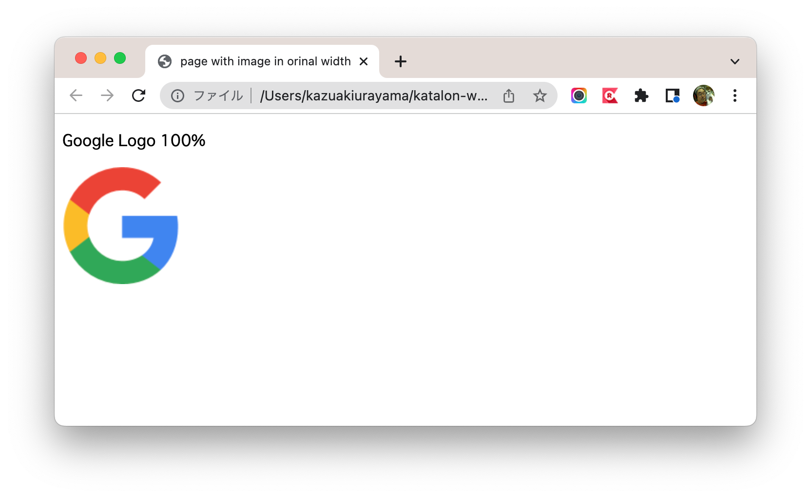
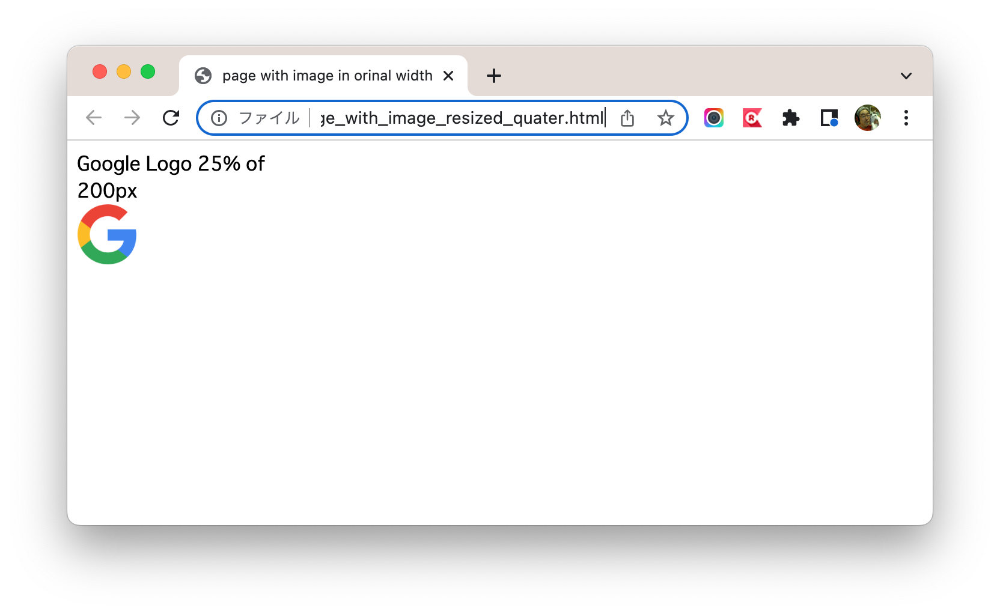

# [Katalon Studio] WebUI.verifyImagePresent() keyword fails when image on HTML is resized

This is a small [Katalon Studio](https://katalon.com/katalon-studio/) project for demonstration purpose.
You can download the zip from the [Releases page](https://github.com/kazurayam/WebUI_verifyImagePresent_keyword_fails_when_image_is_resized_on_HTML/releases), unzip it,
open it with your local Katalon Studio.

This project was developed using Katalon Studio v8.3.0 but will work on any version.

## What I argue here

This project will demonstrate that `WebUI.verifyImagePresent()' keyword fails
when an image on HTML is resized by CSS width property.
This keyword will certainly disappoint users who naively expects the keyword work
regardless how the image is scaled by CSS.

## Reproducing problem

### Target HTML Page

This project contains a Google Logo image named `GoogleGLogo-1.png`, which looks like this: 

This project provides 2 HTML files. One is named `page_with_image_in_original_width.html` where the Logo is display in its original size. It looks like this: 

Another is named `page_with_image_resized_quater.html` where the Logo is displayed smaller that its original size.which looks like this: 

Please note that both HTML refers to the same PNG image file but displays it in different size.

### Test Case TC1

I have made 2 Test Case scripts.

[`TC1`](Scripts/TC1_original_size/Script1660742166505.groovy) opens the `page_with_image_in_original_width.html` and applies `WebUI.verifyImagePresent()` keyword.
```
import java.nio.file.Path
import java.nio.file.Paths
import java.time.LocalDateTime
import java.time.ZoneOffset
import java.time.format.DateTimeFormatter
import java.time.temporal.ChronoUnit

import com.kms.katalon.core.configuration.RunConfiguration
import com.kms.katalon.core.testobject.ConditionType
import com.kms.katalon.core.testobject.TestObject
import com.kms.katalon.core.webui.keyword.WebUiBuiltInKeywords as WebUI
import static com.kms.katalon.core.testobject.ObjectRepository.findTestObject

Path projectDir = Paths.get(RunConfiguration.getProjectDir())

/**
 * Case where HTML displays the image in its original size
 */
Path html1 = projectDir.resolve("page_with_image_in_original_width.html")

WebUI.openBrowser(html1.toFile().toURI().toURL().toExternalForm())
WebUI.delay(3)
WebUI.verifyImagePresent(findTestObject("GoogleLogo"))   // this will pass

// close the page
WebUI.closeBrowser()
```
TC1 will pass.

### Test Case TC2

[`TC2`](Scripts/TC2_resized/Script1660742150928.groovy) is almost identical to TC1. The only difference is that TC2 opens the `page_with_image_resized_quater.html` page. **TC2 will always fail**.

```
2022-08-17 23:09:15.847 DEBUG testcase.TC2_resized                     - 5: verifyImagePresent(findTestObject("GoogleLogo"))
2022-08-17 23:09:18.729 ERROR c.k.k.core.keyword.internal.KeywordMain  - ❌ Image: 'GoogleGLogo-1.png' is NOT present (Root cause: com.kms.katalon.core.exception.StepFailedException: Image: 'GoogleGLogo-1.png' is NOT present
	at com.kms.katalon.core.webui.keyword.internal.WebUIKeywordMain.stepFailed(WebUIKeywordMain.groovy:64)
	at com.kms.katalon.core.webui.keyword.builtin.VerifyImagePresentKeyword$_verifyImagePresent_closure1.doCall(VerifyImagePresentKeyword.groovy:92)
	at com.kms.katalon.core.webui.keyword.builtin.VerifyImagePresentKeyword$_verifyImagePresent_closure1.call(VerifyImagePresentKeyword.groovy)
	at com.kms.katalon.core.webui.keyword.internal.WebUIKeywordMain.runKeyword(WebUIKeywordMain.groovy:20)
	at com.kms.katalon.core.webui.keyword.builtin.VerifyImagePresentKeyword.verifyImagePresent(VerifyImagePresentKeyword.groovy:94)
	at com.kms.katalon.core.webui.keyword.builtin.VerifyImagePresentKeyword.execute(VerifyImagePresentKeyword.groovy:67)
	at com.kms.katalon.core.keyword.internal.KeywordExecutor.executeKeywordForPlatform(KeywordExecutor.groovy:74)
	at com.kms.katalon.core.webui.keyword.WebUiBuiltInKeywords.verifyImagePresent(WebUiBuiltInKeywords.groovy:2794)
	at com.kms.katalon.core.webui.keyword.WebUiBuiltInKeywords$verifyImagePresent$0.call(Unknown Source)
	at TC2_resized.run(TC2_resized:23)
	at com.kms.katalon.core.main.ScriptEngine.run(ScriptEngine.java:194)
	at com.kms.katalon.core.main.ScriptEngine.runScriptAsRawText(ScriptEngine.java:119)
	at com.kms.katalon.core.main.TestCaseExecutor.runScript(TestCaseExecutor.java:445)
	at com.kms.katalon.core.main.TestCaseExecutor.doExecute(TestCaseExecutor.java:436)
	at com.kms.katalon.core.main.TestCaseExecutor.processExecutionPhase(TestCaseExecutor.java:415)
	at com.kms.katalon.core.main.TestCaseExecutor.accessMainPhase(TestCaseExecutor.java:407)
	at com.kms.katalon.core.main.TestCaseExecutor.execute(TestCaseExecutor.java:284)
	at com.kms.katalon.core.main.TestCaseMain.runTestCase(TestCaseMain.java:142)
	at com.kms.katalon.core.main.TestCaseMain.runTestCase(TestCaseMain.java:133)
	at com.kms.katalon.core.main.TestCaseMain$runTestCase$0.call(Unknown Source)
	at TempTestCase1660745344576.run(TempTestCase1660745344576.groovy:25)
)
2022-08-17 23:09:19.162 ERROR c.k.k.core.keyword.internal.KeywordMain  - ❌ Unable to verify image present (Root cause: com.kms.katalon.core.exception.StepFailedException: Unable to verify image present
	at com.kms.katalon.core.webui.keyword.internal.WebUIKeywordMain.stepFailed(WebUIKeywordMain.groovy:64)
	at com.kms.katalon.core.webui.keyword.internal.WebUIKeywordMain.runKeyword(WebUIKeywordMain.groovy:26)
	at com.kms.katalon.core.webui.keyword.builtin.VerifyImagePresentKeyword.verifyImagePresent(VerifyImagePresentKeyword.groovy:94)
	at com.kms.katalon.core.webui.keyword.builtin.VerifyImagePresentKeyword.execute(VerifyImagePresentKeyword.groovy:67)
	at com.kms.katalon.core.keyword.internal.KeywordExecutor.executeKeywordForPlatform(KeywordExecutor.groovy:74)
	at com.kms.katalon.core.webui.keyword.WebUiBuiltInKeywords.verifyImagePresent(WebUiBuiltInKeywords.groovy:2794)
	at com.kms.katalon.core.webui.keyword.WebUiBuiltInKeywords$verifyImagePresent$0.call(Unknown Source)
	at TC2_resized.run(TC2_resized:23)
	at com.kms.katalon.core.main.ScriptEngine.run(ScriptEngine.java:194)
	at com.kms.katalon.core.main.ScriptEngine.runScriptAsRawText(ScriptEngine.java:119)
	at com.kms.katalon.core.main.TestCaseExecutor.runScript(TestCaseExecutor.java:445)
	at com.kms.katalon.core.main.TestCaseExecutor.doExecute(TestCaseExecutor.java:436)
	at com.kms.katalon.core.main.TestCaseExecutor.processExecutionPhase(TestCaseExecutor.java:415)
	at com.kms.katalon.core.main.TestCaseExecutor.accessMainPhase(TestCaseExecutor.java:407)
	at com.kms.katalon.core.main.TestCaseExecutor.execute(TestCaseExecutor.java:284)
	at com.kms.katalon.core.main.TestCaseMain.runTestCase(TestCaseMain.java:142)
	at com.kms.katalon.core.main.TestCaseMain.runTestCase(TestCaseMain.java:133)
	at com.kms.katalon.core.main.TestCaseMain$runTestCase$0.call(Unknown Source)
	at TempTestCase1660745344576.run(TempTestCase1660745344576.groovy:25)
Caused by: com.kms.katalon.core.exception.StepFailedException: Image: 'GoogleGLogo-1.png' is NOT present
	at com.kms.katalon.core.webui.keyword.internal.WebUIKeywordMain.stepFailed(WebUIKeywordMain.groovy:64)
	at com.kms.katalon.core.webui.keyword.builtin.VerifyImagePresentKeyword$_verifyImagePresent_closure1.doCall(VerifyImagePresentKeyword.groovy:92)
	at com.kms.katalon.core.webui.keyword.builtin.VerifyImagePresentKeyword$_verifyImagePresent_closure1.call(VerifyImagePresentKeyword.groovy)
	at com.kms.katalon.core.webui.keyword.internal.WebUIKeywordMain.runKeyword(WebUIKeywordMain.groovy:20)
	... 17 more
)
2022-08-17 23:09:19.180 ERROR c.k.katalon.core.main.TestCaseExecutor   - ❌ Test Cases/TC2_resized FAILED.
Reason:
com.kms.katalon.core.exception.StepFailedException: Unable to verify image present
	at com.kms.katalon.core.webui.keyword.internal.WebUIKeywordMain.stepFailed(WebUIKeywordMain.groovy:64)
	at com.kms.katalon.core.webui.keyword.internal.WebUIKeywordMain.runKeyword(WebUIKeywordMain.groovy:26)
	at com.kms.katalon.core.webui.keyword.builtin.VerifyImagePresentKeyword.verifyImagePresent(VerifyImagePresentKeyword.groovy:94)
	at com.kms.katalon.core.webui.keyword.builtin.VerifyImagePresentKeyword.execute(VerifyImagePresentKeyword.groovy:67)
	at com.kms.katalon.core.keyword.internal.KeywordExecutor.executeKeywordForPlatform(KeywordExecutor.groovy:74)
	at com.kms.katalon.core.webui.keyword.WebUiBuiltInKeywords.verifyImagePresent(WebUiBuiltInKeywords.groovy:2794)
	at com.kms.katalon.core.webui.keyword.WebUiBuiltInKeywords$verifyImagePresent$0.call(Unknown Source)
	at TC2_resized.run(TC2_resized:23)
	at com.kms.katalon.core.main.ScriptEngine.run(ScriptEngine.java:194)
	at com.kms.katalon.core.main.ScriptEngine.runScriptAsRawText(ScriptEngine.java:119)
	at com.kms.katalon.core.main.TestCaseExecutor.runScript(TestCaseExecutor.java:445)
	at com.kms.katalon.core.main.TestCaseExecutor.doExecute(TestCaseExecutor.java:436)
	at com.kms.katalon.core.main.TestCaseExecutor.processExecutionPhase(TestCaseExecutor.java:415)
	at com.kms.katalon.core.main.TestCaseExecutor.accessMainPhase(TestCaseExecutor.java:407)
	at com.kms.katalon.core.main.TestCaseExecutor.execute(TestCaseExecutor.java:284)
	at com.kms.katalon.core.main.TestCaseMain.runTestCase(TestCaseMain.java:142)
	at com.kms.katalon.core.main.TestCaseMain.runTestCase(TestCaseMain.java:133)
	at com.kms.katalon.core.main.TestCaseMain$runTestCase$0.call(Unknown Source)
	at TempTestCase1660745344576.run(TempTestCase1660745344576.groovy:25)
Caused by: com.kms.katalon.core.exception.StepFailedException: Image: 'GoogleGLogo-1.png' is NOT present
	at com.kms.katalon.core.webui.keyword.internal.WebUIKeywordMain.stepFailed(WebUIKeywordMain.groovy:64)
	at com.kms.katalon.core.webui.keyword.builtin.VerifyImagePresentKeyword$_verifyImagePresent_closure1.doCall(VerifyImagePresentKeyword.groovy:92)
	at com.kms.katalon.core.webui.keyword.builtin.VerifyImagePresentKeyword$_verifyImagePresent_closure1.call(VerifyImagePresentKeyword.groovy)
	at com.kms.katalon.core.webui.keyword.internal.WebUIKeywordMain.runKeyword(WebUIKeywordMain.groovy:20)
	... 17 more

2022-08-17 23:09:19.195 INFO  c.k.katalon.core.main.TestCaseExecutor   - END Test Cases/TC2_resized

```

## Why WebUI.verifyImagePresent fails in TC2?

You can read the Groovy source code of `WebUI.verifyImagePresent` keyword [here](https://github.com/katalon-studio/katalon-studio-testing-framework/blob/master/Include/scripts/groovy/com/kms/katalon/core/webui/keyword/builtin/VerifyImagePresentKeyword.groovy). If you read the code, you would find how this keyword works.

1. The keyword requires user to give reference to the original image file.
2. The keyword takes a full page screenshot of the target web page.
3. The keyword looks for the original image to appear somewhere in the screenshot. No image scaling is taken into account.

Now you should review this design. This design naively assumes that *the original image is rendered "as is" without any resizing in the web page.*

If the target HTML specifies image to be resized like

````, then the `WebUI.verifyImagePresent()```

 keyword will always fail to find the image to be present in the page.


## Conclusion

In most cases an `` tag has CSS property that specifies the size of the image to be rendered. The `WebUI.verifyImagePresent()` keyword requests you not to resize images at all. Silly request, isn't it? Therefore I would argue that katalon users should not use `WebUI.verifyImagePresent` keyword at all.

I haven't checked it but I guess `Mobile.verifyImagePresent` keyword is similar. You shouldn't use it.


